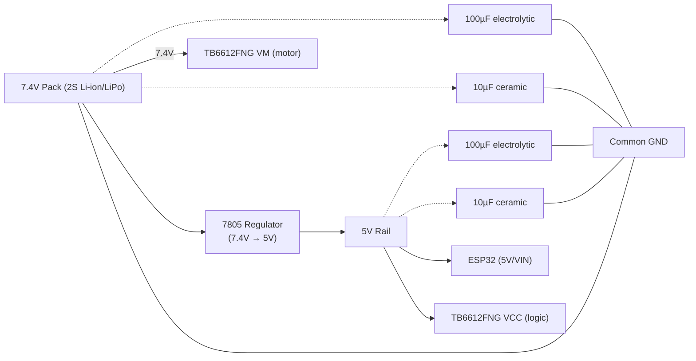
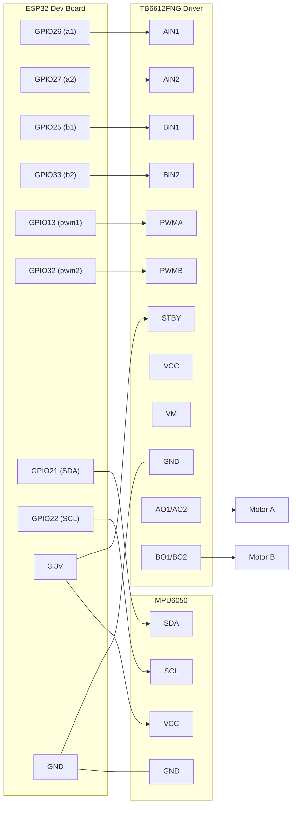

 # hope_rebuild

A ground-up rewrite of **Hope**, a self-balancing / heading-controlled differential-drive robot built on ESP32. This version restructures the original Hope firmware into clean, reusable C++ classes — MPU6050 fusion, PID heading control, motor driving, and Wi-Fi/TCP telemetry — and adds a Python-side live plotter for tuning.

## Overview

The robot uses an MPU6050 (via its onboard DMP) to estimate yaw, and a PID controller to hold or steer toward a target heading by differentially driving two motors through an H-bridge. Yaw and timing data are streamed live over a raw TCP socket so they can be visualized on a computer while tuning.

## Hardware Specifications

| Component | Spec |
|---|---|
| MCU | ESP32 dev board (dual-core, Wi-Fi, 3.3V logic) |
| IMU | MPU6050 — 3-axis gyro + 3-axis accel, onboard DMP, I2C (SDA/SCL) |
| Motor driver | **TB6612FNG** dual H-bridge — 2-channel, up to ~1.2 A continuous/channel, 2.5–13.5 V motor supply, separate logic (VCC) and motor (VM) rails, active-low standby (STBY) |
| Motors | 2× DC gear motors (differential drive) |
| Chassis | 2-wheel differential-drive base + caster |
| Power | 7.4V pack (2S Li-ion/LiPo) → TB6612FNG motor rail (VM) directly; 7805 linear regulator steps 7.4V down to 5V for ESP32 + logic |
| Voltage regulator | 7805 linear regulator, 7.4V → 5V, with 100µF electrolytic + 10µF ceramic caps on **both** the 7.4V input and 5V output sides |

### Power regulation

The pack voltage (7.4V) is split two ways:
- **Straight to the TB6612FNG's `VM` pin** — the motors run directly off the 7.4V rail.
- **Through a 7805 linear regulator down to 5V** — this rail powers the ESP32 and the TB6612FNG's logic (`VCC`).

Each side of the 7805 has a decoupling pair to ground:
- **Input (7.4V) side**: 100µF electrolytic (bulk filtering of the raw battery rail) + 10µF ceramic (suppresses high-frequency switching noise from the motor driver before it reaches the regulator).
- **Output (5V) side**: 100µF electrolytic (holds the rail steady during motor current transients) + 10µF ceramic (filters residual high-frequency noise for the ESP32/logic).

This input+output capacitor pairing is standard practice for linear regulators feeding a motor-driven system — it keeps the regulator stable and stops motor switching noise from resetting or destabilizing the ESP32.

**ESP32 → TB6612FNG pin mapping** (see `Motor.h` constructor call in `hope_rebuild.ino`):

| ESP32 signal (code) | GPIO | TB6612FNG pin | Function |
|---|---|---|---|
| `a1` | 26 | AIN1 | Motor A direction bit 1 |
| `a2` | 27 | AIN2 | Motor A direction bit 2 |
| `b1` | 25 | BIN1 | Motor B direction bit 1 |
| `b2` | 33 | BIN2 | Motor B direction bit 2 |
| `pwm1` | 13 | PWMA | Motor A speed (PWM) |
| `pwm2` | 32 | PWMB | Motor B speed (PWM) |
| — | 3.3V (or spare GPIO tied HIGH) | STBY | Must be held HIGH to take the driver out of standby |
| — | 5V rail (regulated) | VCC | Logic supply |
| — | GND | GND | Common ground (battery, regulator, ESP32, TB6612FNG, MPU6050) |
| — | 7.4V rail (battery, pre-regulator) | VM | Motor supply voltage |

> **Note:** `STBY` isn't driven in the current firmware — wire it directly to 3.3V (or drive it HIGH from a GPIO at boot) or the driver will stay in standby and the motors won't spin. `VM` (7.4V, straight from the battery) and `VCC` (5V, regulated) are separate rails on the TB6612FNG — never power the motors off the ESP32's 3.3V or 5V pin.

**MPU6050 → ESP32 (I2C):**

| MPU6050 | ESP32 |
|---|---|
| VCC | 3.3V |
| GND | GND |
| SDA | GPIO 21 (default I2C SDA) |
| SCL | GPIO 22 (default I2C SCL) |
| INT | (optional, not used by DMP-polling code here) |

## Circuit Diagram

### Power distribution



### Signal wiring




## Firmware structure

| File | Responsibility |
|---|---|
| `hope_rebuild.ino` | Main sketch: setup/calibration and the control loop |
| `Angle.h` | `mpu` class — wraps `MPU6050_6Axis_MotionApps20`, handles DMP init, yaw extraction, gyro-rate reading, and startup calibration/offset removal |
| `Control.h` | `pid` class — a standard PID computed on `(error, dt)`, output constrained to ±155 (PWM-safe range) |
| `Motor.h` | `motor` class — direction + PWM control for a differential drive (`forward`, `backward`, `left`, `right`, `turn`) |
| `TCP.h` | `tcp` class — connects to Wi-Fi and runs a `WiFiServer` on port `1234` that streams `angle,time` pairs to any connected client |
| `Web_controller.h` | Web-based control interface/handlers for driving the robot over Wi-Fi |
| `plot.py` | PyQtGraph client that connects to the ESP32's TCP server and plots live yaw vs. time for debugging/tuning |
| `.theia/` | Eclipse Theia IDE workspace config |

## How it works

1. **Setup**: Motor PWM pins are configured, Wi-Fi connects (`tcp::connect`), the TCP server starts, and the MPU6050 + DMP are initialized.
2. **Calibration**: `mpu::caliberate()` warms up the DMP, then samples ~1000 readings to compute a yaw offset and gyro-rate offset, canceling out drift/bias before the loop starts.
3. **Control loop** (`loop()` in `hope_rebuild.ino`):
   - Reads a new DMP packet when available (throttled to ~100 Hz via a 10 ms `dt` check).
   - Computes heading `error = angle - target`.
   - Feeds `error` and `dt` into the PID (`pid::compute`) to get a motor correction `output`.
   - If the heading error is outside a ±5° deadband, the robot turns in place (`motor::turn`) toward the target; otherwise it drives forward while applying the PID correction differentially to each side (`motor::forward`).
   - Streams the current angle and timestamp to any connected TCP client.

## Getting started

### Firmware
1. Open `hope_rebuild.ino` in the Arduino IDE (or the included Theia workspace) with ESP32 board support installed.
2. Install the Arduino libraries: `I2Cdevlib` (`I2Cdev`, `MPU6050_6Axis_MotionApps20`), and the built-in `WiFi.h`.
3. Update the Wi-Fi SSID/password passed to `tcp server(...)` in `hope_rebuild.ino`.
4. Wire the MPU6050 over I2C and the motor driver to the pins listed above.
5. Flash the sketch. On boot it will connect to Wi-Fi, print its IP over Serial, calibrate the IMU, and start the control loop.

### Live plotting (optional)
1. `pip install pyqtgraph pyqt5`
2. In `plot.py`, set `host` to the ESP32's IP address (printed over Serial on boot).
3. Run `python plot.py` to see live yaw vs. time while the robot is running — useful for tuning the PID gains in `Control.h`.

## Tuning

PID gains are set where the controller is constructed in `hope_rebuild.ino`:
```cpp
pid p(40, 0., 1.3); // Kp, Ki, Kd
```
Adjust these and re-flash to tune heading-hold/turning behavior. The `target` variable sets the desired heading in degrees.

## Status / notes

- This is an active robotics project; some code paths (e.g. `backward()`) are present but not yet wired into the main loop.
- No license file is currently included.
